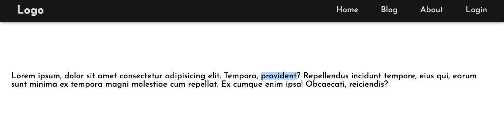
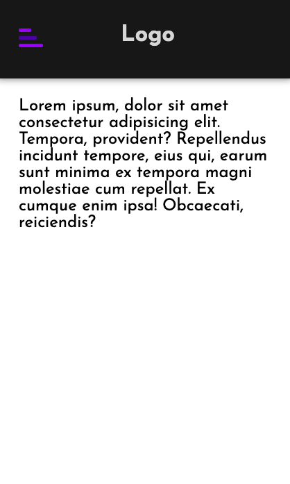
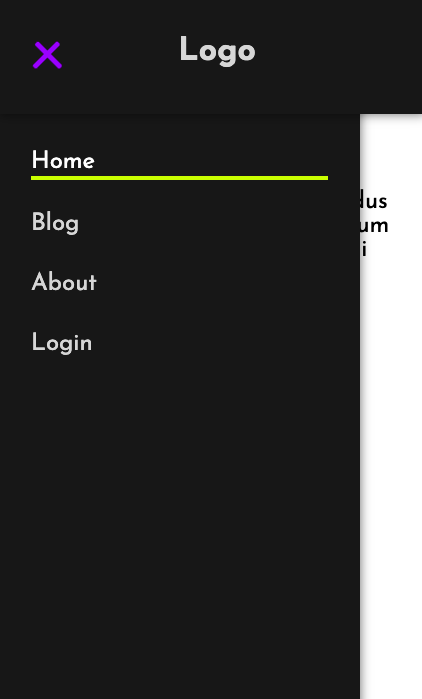

# simple-responsive-navbar

Simple responsive navbar using `HTML5`, `CSS3` and `JavaScript`.

## Table of contents

- [Output images](#output-images)
- [License](#license)

## Output images

## License

[MIT](./LICENSE)
